# 2026-05-18 ds4-server cpu-moe 実測ログ

DeepSeek-V4-Flash 153 GiB モデルを Apple M4 Max / 128 GiB の Mac で
`--cpu-moe` + `--prefill-metal-phases auto` で動かしたときの実測ログとスクリーンショット。
スクショ → グラフ → 数値解析の順で並べてあるので、上から流し読みすると現象が掴める。

English version: [README.md](README.md)

## スクリーンショット

### chat
<p>
  <a href="chat-01.png">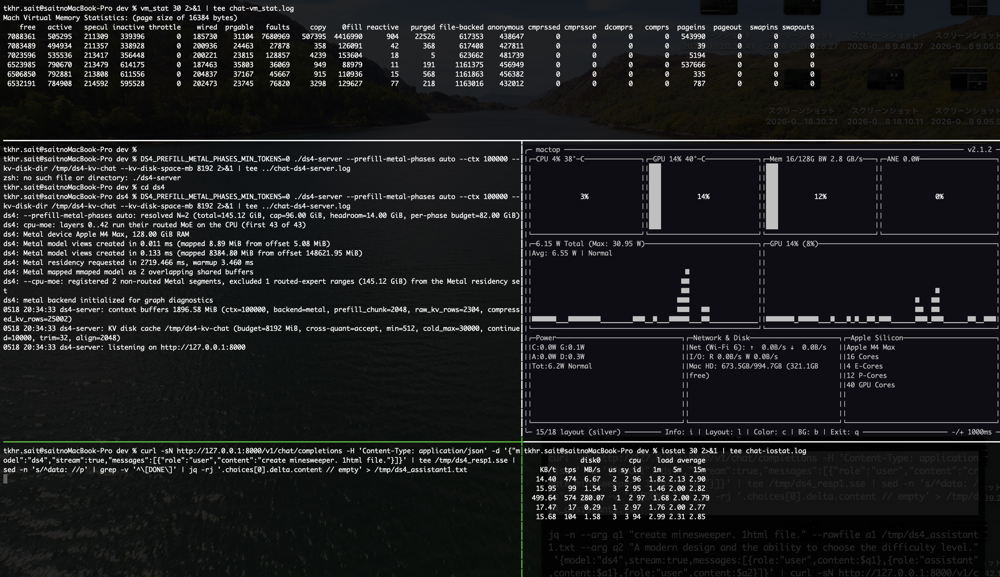</a>
  <a href="chat-02.png">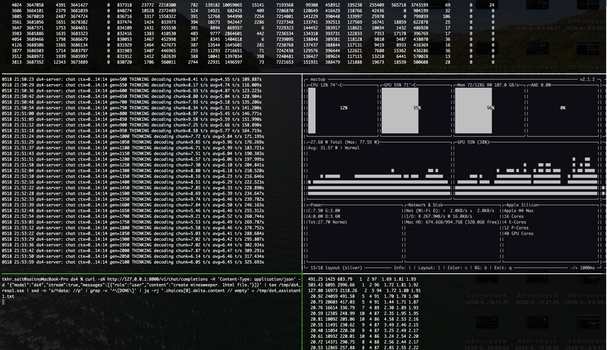</a>
  <a href="chat-03.png">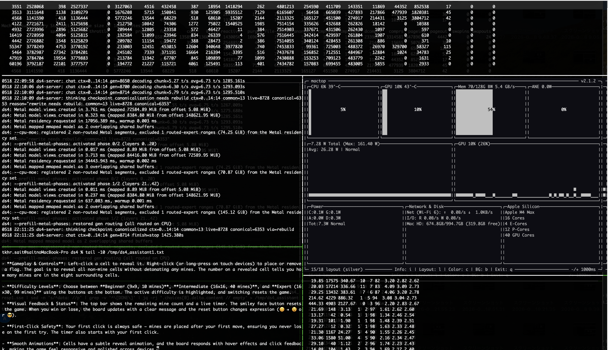</a>
</p>

### opencode
<p>
  <a href="opencode-01.png">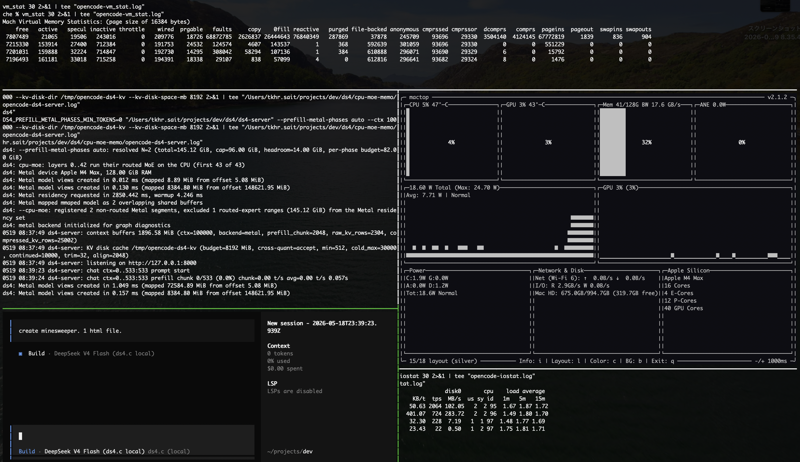</a>
  <a href="opencode-02.png">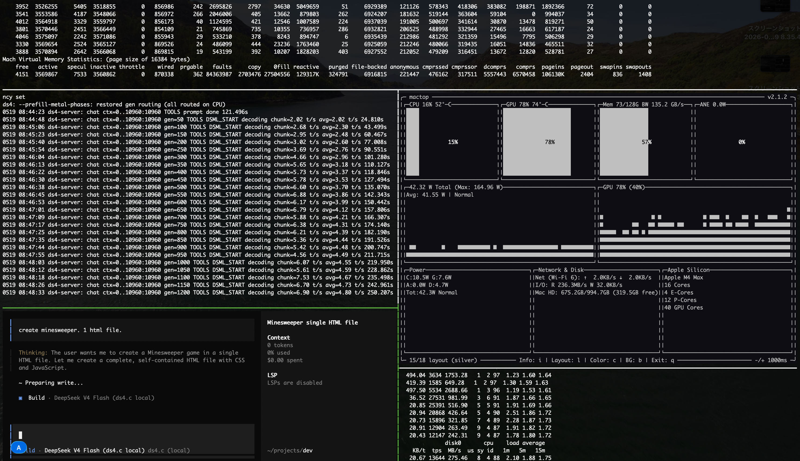</a>
  <a href="opencode-03.png">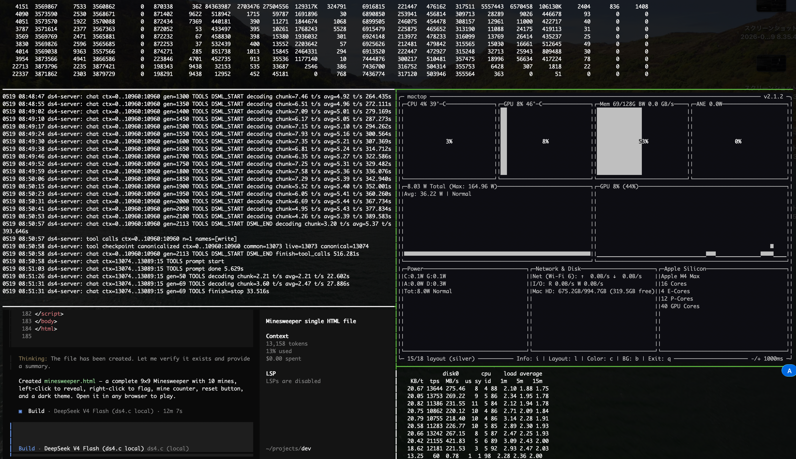</a>
</p>

## 環境

- Apple M4 Max, 128.00 GiB RAM (Metal device)
- ds4-server: `--prefill-metal-phases auto --ctx 100000 --kv-disk-space-mb 8192`
- `DS4_PREFILL_METAL_PHASES_MIN_TOKENS=0`
- `--cpu-moe`: layers 0..42 の routed MoE を CPU 実行 (full 43 層)
- `--prefill-metal-phases auto` が **N=2** を自動解決
  (total=145.12 GiB, cap=96.00 GiB, headroom=14.00 GiB, per-phase budget=82.00 GiB)
- iostat / vm_stat は **30 秒間隔** でサンプリング

## 仕様概要

このセッションで使った 2 つのフラグは、routed MoE の配置を prefill / gen 別に
切り替える独立した dial になっている。正規の説明は `ds4-server --help`
(`ds4_server.c:7909-7927`) を参照。以下はユーザー向け要約。

### `--cpu-moe` / `--n-cpu-moe N`

- routed MoE expert の演算を CPU 側で行い、対応する weight を **Metal の
  wired residency に乗せない**。当該ページは OS の file-backed cache に置き、
  はみ出した分は SSD から都度 page-in される。
- `--cpu-moe` = 全 43 routed 層を CPU。`--n-cpu-moe N` = 先頭 N 層だけ CPU、
  残りは GPU (llama.cpp と同じ意味論)。
- 153 GiB GGUF が 128 GiB Mac に収まるのは、Metal が抱えるのが
  attention / embed / output head / shared expert といった非 routed セグメント
  だけになるため。これが `vmstat-mem` の gen 区間で見える ~13 GiB の `wired`
  下限。
- CPU 側の matmul kernel 選択 (Q4_K weight × Q8_K activation):
  - **prefill cpu-moe fallback** (`n_tok ≥ 2`): NEON **i8mm 2x2** SMMLA mini
    panel (activation 2 本 × expert row 2 本を 1 内ループでペア)。検出は
    Darwin: `sysctlbyname`、Linux: `HWCAP2_I8MM`。`DS4_DISABLE_I8MM=1` で無効化可。
  - **gen / decode** (`n_tok = 1`): NEON **DOTPROD**。activation が 1 本では
    SMMLA の 2x2 を埋められないため i8mm は使わない。
  - routed が Q2_K / IQ2_XXS の場合は常に NEON DOTPROD。
- Metal backend 専用。

### `--prefill-metal-phases auto|N`

- prefill を Metal 上で **N 個に等分割した phase** として実行。phase 切替時に
  routed expert の residency を入れ替えて、各 phase の作業集合が Metal の
  wired-memory cap に収まるようにする。
- `auto` は `sysctl iogpu.wired_limit_mb` (`hw.memsize` で上限) から headroom
  (`DS4_PREFILL_METAL_PHASES_HEADROOM_MIB`, default **14336**) を引いた
  per-phase budget を作り、routed expert 範囲がそれに収まる最小 N を選ぶ。
  本セッションでは `total=145.12 GiB / (cap 96.00 - headroom 14.00)
  = per-phase 82.00 GiB → N=2`。
- 各 phase 入口で `engine_activate_prefill_phase(p)` が走り、`iostat-disk` の
  黄帯ピーク (2.2–2.8 GB/s) として page-in burst が現れる。
- prefill が終わると `engine_restore_gen_routing()` が全 routed 層を CPU に
  戻し、gen は **`--cpu-moe` path にフォールバック**する。Metal residency は
  ~13 GiB の非 routed 集合に縮み、routed expert は file-backed cache 経由で
  読まれる。full-prefill sync と **extend-checkpoint sync** の両経路が
  `restore` を呼ぶ (per-token decode 分岐は phase activation に触らない)。
- phase mmap を繰り返し安全にできるのは、`set_model_map_range` が in-flight
  Metal command buffer を drain し、直前の `MTLBuffer` view を明示クリア
  してから次 phase を mmap-in するため。これがないと旧 view と新 view が
  同一領域に 2 重で mmap range を握り、`cpt_mapcnt` がカーネルの 2048 制限
  を超える。
- `--cpu-moe` / `--n-cpu-moe` と排他、Metal backend 専用。
- `DS4_PREFILL_METAL_PHASES_MIN_TOKENS` (default 0) は prompt 長の下限で、
  これより短い prefill は Metal phase を組まずに cpu-moe path に流れる。
  本キャプチャでは 0 に固定して、短い chat warmup turn でも phase path を
  通している。

### 役割マトリクス

| フェーズ | routed expert の配置 | matmul kernel | 律速 |
|---|---|---|---|
| prefill (黄帯) | Metal、N phase で residency 入替 | Metal shader | Metal GPU + residency 充填の sustained SSD read |
| prefill cpu-moe fallback (`< MIN_TOKENS`) | CPU、file-backed cache | NEON i8mm 2x2 | CPU matmul + SSD random read |
| gen (緑/青/紫帯) | CPU、file-backed cache + SSD | NEON DOTPROD | キャッシュミスの SSD random read (QD=1) |

## 計測手順

`../README.md` 参照。要約:

```sh
TEST_PREFIX=chat   # or opencode
vm_stat 30 2>&1 | tee ${TEST_PREFIX}-vm_stat.log
iostat 30 2>&1 | tee ${TEST_PREFIX}-iostat.log
DS4_PREFILL_METAL_PHASES_MIN_TOKENS=0 ./ds4-server \
  --prefill-metal-phases auto --ctx 100000 \
  --kv-disk-dir /tmp/${TEST_PREFIX}-ds4-kv --kv-disk-space-mb 8192 \
  2>&1 | tee ${TEST_PREFIX}-ds4-server.log
```

## ファイル一覧

| ファイル | 内容 |
|---|---|
| `chat-ds4-server.log` | ds4-server ログ (チャット: 1 リクエスト, 8714 tok 生成) |
| `chat-iostat.log` | iostat 30s |
| `chat-vm_stat.log` | vm_stat 30s |
| `chat-01.png` / `chat-02.png` / `chat-03.png` | チャット中の tmux スクショ |
| `opencode-ds4-server.log` | ds4-server ログ (opencode 連携・3 ターン) |
| `opencode-iostat.log` | iostat 30s |
| `opencode-vm_stat.log` | vm_stat 30s |
| `opencode-01.png` / `opencode-02.png` / `opencode-03.png` | opencode 中の tmux スクショ |
| `plots/*.svg` | 後述の自動生成グラフ |

## グラフ

`scripts/make_plots.py` (一つ上のディレクトリ) でログから自動生成。

```sh
python3 ../scripts/make_plots.py .
```

各プロットの背景帯は ds4-server log から検出した phase:

- **黄**: prefill (Metal residency 構築/再構築を含む)
- **青**: THINKING gen
- **緑**: answer gen (通常応答)
- **紫**: TOOLS gen (opencode)
- **オレンジ**: thinking checkpoint canonicalization

iostat / vm_stat は独自クロックなので帯位置は ds4-server epoch に対し ±10-30s の誤差を含みます (両ロガーは ds4-server より数秒早く起動)。tok プロットだけは ds4-server log と同じタイムスタンプを使うため厳密。

### chat

<p>
  <a href="plots/chat-tok.svg">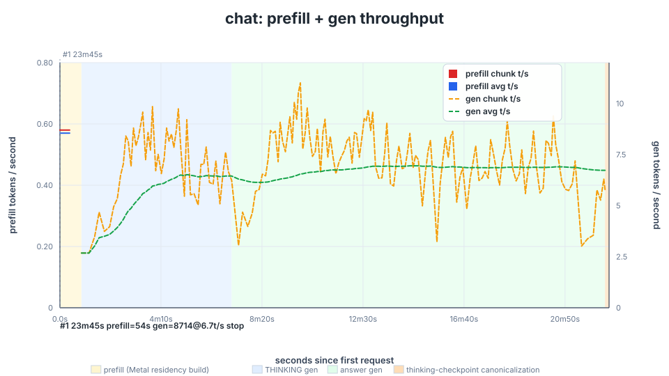</a>
  <a href="plots/chat-iostat-disk.svg">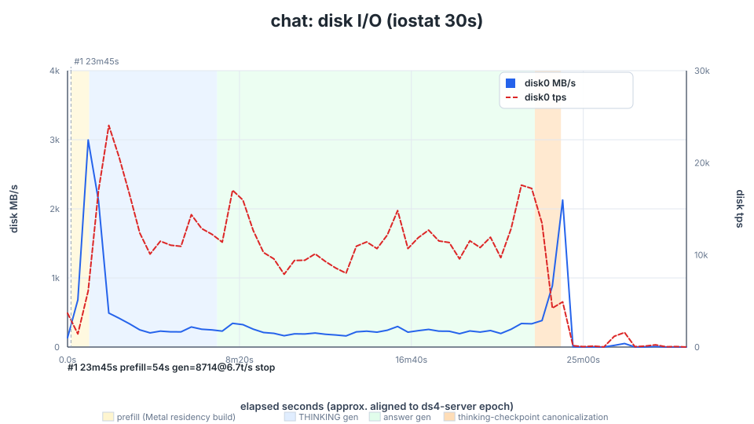</a>
</p>
<p>
  <a href="plots/chat-iostat-cpu.svg">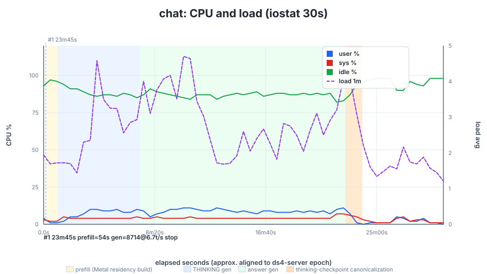</a>
  <a href="plots/chat-vmstat-mem.svg">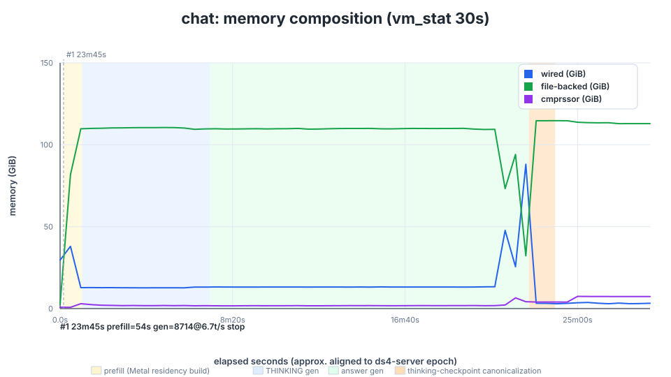</a>
</p>
<p>
  <a href="plots/chat-vmstat-events.svg">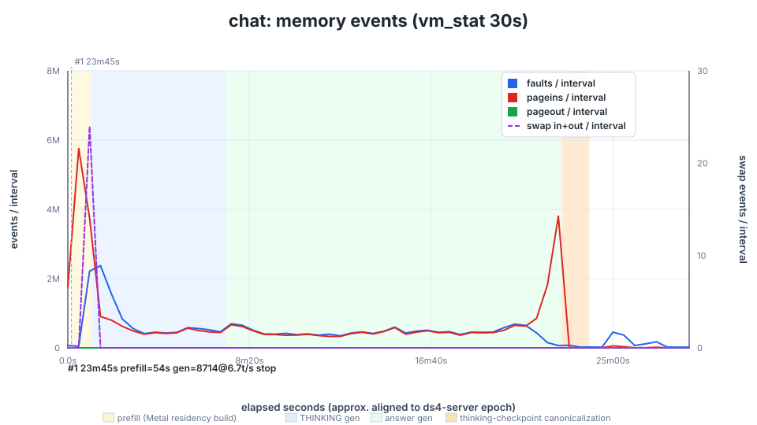</a>
</p>

### opencode

<p>
  <a href="plots/opencode-tok.svg">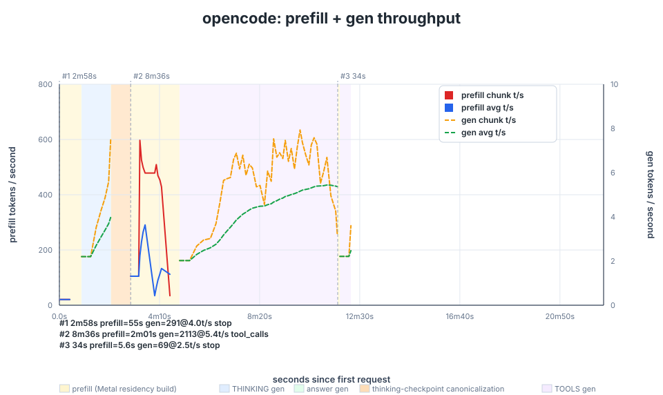</a>
  <a href="plots/opencode-iostat-disk.svg">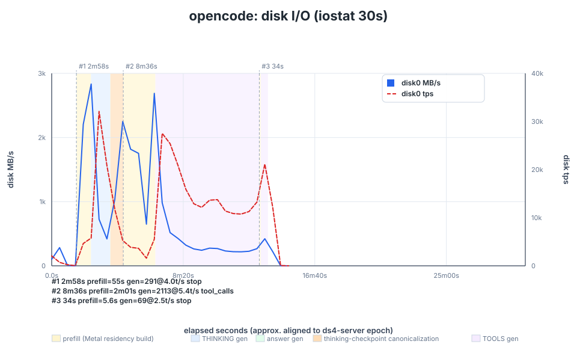</a>
</p>
<p>
  <a href="plots/opencode-iostat-cpu.svg">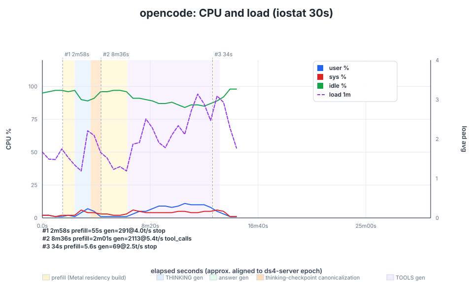</a>
  <a href="plots/opencode-vmstat-mem.svg">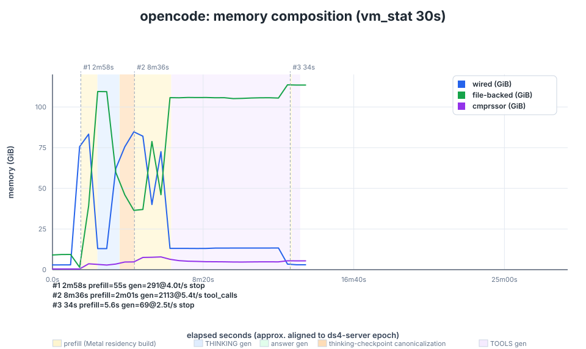</a>
</p>
<p>
  <a href="plots/opencode-vmstat-events.svg">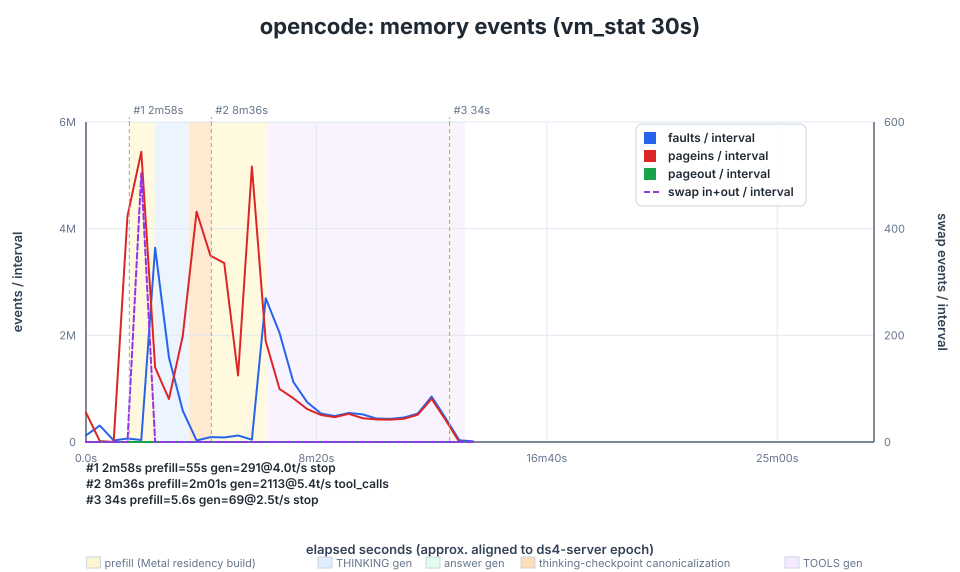</a>
</p>

> `chunk t/s` (赤) は直近 50 トークンの瞬間スループット、`avg t/s` (青) はリクエスト累積平均。
>
> `vmstat-mem` は `wired` (Metal residency) / `file-backed` (mmap キャッシュ) / `cmprssor` (圧縮プール) の構成比。シーソーで動く。`vmstat-events` は `faults` / `pageins` / `pageout` を左軸、`swap in+out` を右軸に出していて、**pageout や swap 線がゼロ軸から離れたら異常 / 圧迫**サイン。
>
> opencode tok プロットの x 軸読み方: `prompt start` が 3 回ありそれぞれ **t=0s** (system prompt, THINKING 533→291 tok)、**t≈178s** (TOOLS, 10960→2113 tok)、**t≈694s** (tool 後 follow-up, 15→69 tok)。`elapsed` は turn ごとに 0 に戻るので、灰色破線がセッション境界。
>
> opencode vmstat-mem の wired 時系列: `3→76→83 GiB` (t≈60-120s, Turn 1 phase build) → `13 GiB` (t≈150-180s, Turn 1 gen) → `62→76→85→82→40→73 GiB` (t≈210-300s, canonicalization + Turn 2 prefill 2 周分) → `13 GiB` 平坦 (t≈390-720s, Turn 2 gen + Turn 3) → `3 GiB` (t≈780s 以降, unload)。

## 実測サマリ

「raw な秒数や t/s は `*-ds4-server.log` を引用」、ここでは `--cpu-moe` + `--prefill-metal-phases` の **設計通りに見えている部分** と **設計上残る改善余地** を整理する。

### cpu-moe 設計通りに見えている挙動

- **gen 中 wired ~13 GiB (= attention 系が GPU/Metal に常駐)**: attention / embed / output head などの非 routed 層は Metal-resident で wired に乗る。`--cpu-moe` は routed expert (145 GiB) を residency 集合から除外する設計なので、wired はこの 13 GiB で平坦
- **gen 中 disk 200–520 MB/s が継続 (= expert を file-backed cache → SSD の 2 段で読む)**: routed expert は CPU 側で mmap して、`vmstat-mem` の **file-backed (~110 GiB) が一次キャッシュ** として働く。token ごとに 6/256 expert を選ぶが 145 GiB > 110 GiB のためキャッシュに乗り切らず、ミスした分が iostat の **20k–27k tps / 200–520 MB/s** として SSD から page-in されている
- **prefill phase swap で 2.2–2.8 GB/s burst**: `--prefill-metal-phases auto N=2` が 70–84 GiB を一度に Metal residency に mmap-in する設計。iostat disk プロットの黄帯のピークがこれ
- **chat prefill 53s / opencode Turn 1 prefill 55s が ~24s + ~29s の 2 段**: phase 0/2 → phase 1/2 を逐次 mmap-in する設計通りの 2 山。1 段目より 2 段目が長いのは phase 1/2 (layers 21..42) の方が含む weight が多いため
- **prefill 終了で wired が即 13 GiB に降りる**: `engine_restore_gen_routing()` が全 routed を CPU に戻し Metal residency 集合を non-routed のみに縮める設計。vm_stat プロットの黄→緑/紫 帯境界で wired が急降下するのと一致
- **pageins スパイクが phase mmap 時のみ**: vm_stat の pageins 右軸 (各サンプル 30s 分の page-in 数) が、Metal residency 構築/再構築の 30s 窓だけ M 単位、それ以外は 0.4–1.0 M で推移。これは「CPU MoE の常時 page-in」と「phase mmap の一度きり burst」を切り分けている

### 改善可能ポイント

- **Warmup**: cold start だと最初の prompt の prefill に Metal residency 初回 build がそのまま乗る (opencode Turn 1 prefill 54.7s のほぼ全部、phase 0/2 mmap + phase 1/2 mmap で約 53s)。サーバ起動 → listen 直後にバックグラウンドで `engine_activate_prefill_phase(0)` → `engine_activate_prefill_phase(1)` → `engine_restore_gen_routing` を一周しておけば、最初の prompt はこの初回 build を肩代わりせずに済む
- **Hot expert を Metal residency に固定 (gen 経路の GPU 化)**: 現状 gen の routed expert 演算は CPU NEON DOTPROD (i8mm 2x2 は prefill 限定) で、145 GiB > 110 GiB file cache のため token ごとに SSD page-in が発生 (gen 中 20-27k tps の正体)。**imatrix の `ds4_imatrix_collector.observed_routes` から上位 N expert を抽出して Metal residency に pin** すれば、router が hit した expert は GPU 演算かつ SSD 読み不要になる。`cpu_moe_layer[]` を per-expert decision に拡張するのが主タスク
- **IO 並列 prefetch (cold 経路の QD↑)**: hot pin から漏れた cold expert は依然 CPU + SSD 経由になる。CPU MoE は次の expert を dynamic に決めるので各 page fault は serial → SSD random read が QD=1 (~25k IOPS) で頭打ち。M4 Max NVMe spec は QD=32 で 500k+ IOPS あるので、router の top-K 予測で **次の expert を `madvise(WILLNEED)` で先行 page-in** すれば cold 経路の effective QD を上げられる
- **MTP で gen をバッチ化**: 現状 gen は 1 token ずつで expert 読みが serial。**MTP (speculative draft + verify) で N 個の draft token を 1 forward pass で検証**すれば N 個分の expert 読みがバッチに乗る → 重複 expert は unique page 数が減り、別 expert なら IO を並列化できる。**draft head は Metal-resident に追加収納でき、verify 経路は Hot pin の expert pool をそのまま再利用** するので新規容量は draft head ぶんのみ。ds4 には既に `mtp_draft_tokens` / `metal_graph_verify_suffix_tops` のインフラがあるが `ds4_engine_mtp_draft_tokens()` は `backend != CPU` 条件のみで cpu-moe path での運用整合は未着手

