# 2026-06-02 `--routed-metal-dynamic` 計測

同じ 153 GiB DeepSeek-V4-Flash モデル (Q4) を Apple M4 Max / 128 GiB Mac で動かしつつ、
gen 時の **routed expert を CPU ではなく Metal で計算する**実験経路
`--routed-metal-dynamic` のログ。鍵は **`F_RDADVISE`(実 read を先行発行)を prefill・CPU・GPU の
全経路に効かせ、SSD page-in を計算とオーバーラップさせる**こと。これで dyn は budget(LRU hit%)と
電源モードでスケールし、中庸な **32 GiB で通常 10.58 / 高出力 10.91 t/s — 01 baseline(cpu-moe gen
5.37 t/s, 2026-05-18)の ~2×**(budget を上げれば 8→80 GiB で 高出力 ~7.8→~12.6 t/s)。

English version: [README.md](README.md)

このセッションはフルログ (ds4-server / vm_stat / mactop / trace) を **4 キャプチャ
だけ** — `{cpu, dyn 32 GiB} × {高出力, 通常}` — 保持し、その plot を収録する。
wired budget の全スイープ(8→80 GiB、通常 / 高出力)も数値表として残す。

## 性能の要点(何が効くか)

本セッションで実際に t/s を動かしたレバー。根拠は各節に:

1. **`F_RDADVISE` が全経路(prefill / CPU / GPU)で効く。** Darwin の `posix_madvise(WILLNEED)`
   は vm ヒントのみで I/O を発行しないが、`F_RDADVISE` は **実 read を先行発行**し SSD page-in を
   計算とオーバーラップさせる。効いたのは 3 経路すべて: prefill は 1 層 1 フェーズ(N=43)+ 次層
   先読みで **1.6–2.0×**(111.9 → 182–222 t/s)、CPU gen は選択 expert の先読みで 5.4 → ~10 t/s、
   GPU dynamic 経路も make_buffer の warm を `F_RDADVISE` 化して **IO 律速を解いた**。(`F_RDADVISE`
   は優先度を *繰り返し回数* で表すので、prefill の lookahead はあえて現在の層を再ヒントする。)
   [進化の節](#cpu-moe-baseline-01-cpumoe-baseline-からの進化)参照。
2. **熱マージンが CPU・GPU 両方を律速する。** どちらの経路も高出力+冷房で伸び、外すと落ちる。
   GPU も例外ではない: dyn は大 budget(高 hit%)ほど GPU が本気で回って発熱し、通常モードでは
   GPU クロックが落ちる — 大 budget ほど電源の効きが大きい(72–80 GiB で +10〜14%)、cpu-moe も +4.6%。
   [熱の節](#熱--cpu-も-gpu-も熱マージンで律速)参照。
3. **budget が dyn の速度つまみ。** LRU hit% が t/s を決め、budget とともに上昇(8→80 GiB で
   高出力 ~7.8 → ~12.6、通常 ~8.1 → ~11.5)。利得は SSD でなく **再 wire(`requestResidency`)の
   削減**から。[スイープの節](#wired-budget-スイープ通常--高出力)参照。
4. **改善の余地。** 残る伸びしろは 3 つ — 小〜中規模 prefill の高速化(SME2 SMOPA か GPU 化。
   SME2 は spike で **NEON i8mm 比 3.37×**/P-core、ビット一致)、実装が大雑把ゆえの細粒度最適化、
   発熱を抑える効率化(perf/W)。解消済み(gen の GPU 化 / imatrix の固定は LRU で実現)や
   効かなかった案(MTP)も含め[改善余地](#改善余地)節を参照。

## `--routed-metal-dynamic` とは

`--cpu-moe` は routed expert の重みを Metal residency set の外に置き、gen 時の expert
GEMV を CPU(NEON i8mm/DOTPROD)で計算する(重みは OS page cache / SSD からストリーミング)。
`--routed-metal-dynamic` はその GEMV を **GPU** で実行する: 各 gen ステップで router が
実際に選んだ expert だけを専用 Metal residency set へ **per-expert** で wire し(この Q4 で
1 つ ≈13.5 MiB)、LRU が直近の working set を byte budget 上限まで常駐させ tail を evict
する。既存の Metal `mul_mv_id` カーネルを再利用。

- `--cpu-moe` / `--n-cpu-moe` 併用必須、Metal backend のみ、**既定 off**。
- budget は env `DS4_ROUTED_METAL_BUDGET_MIB`(MiB、既定 40960)。
- gen 専用。prefill は `--prefill-metal-phases` / cpu-moe のままなので、LRU は各生成で
  **コールド**から始まり数千トークンかけて温まる。

```sh
# --cpu-moe の起動にフラグを足すだけ。wired budget は env(既定 40 GiB)
DS4_ROUTED_METAL_BUDGET_MIB=81920 \
  ./ds4-server --cpu-moe --prefill-metal-phases auto --routed-metal-dynamic --ctx 100000
```

(計測は `../scripts/q4-experiment.sh` でも回せる — [再現](#再現)を参照。)

## 仕掛けの図解(prefill と gen)

各ステージがどこで走り、`--cpu-moe` / `--routed-metal-dynamic` がどこに効くか:

```text
PREFILL  — prompt 長 ≥ DS4_PREFILL_METAL_PHASES_MIN_TOKENS ?
        │
        ├─ YES(大) ─▶ GPU、1 層 = 1 phase(--prefill-metal-phases, N=43)
        │             層 L を計算しつつ F_RDADVISE で L+1 を先読み
        │             (prefetch が次層の page-in と重なる)
        │
        └─ NO (小) ─▶ CPU(cpu-moe フォールバック)、NEON i8mm 2×2
                      expert は page cache / SSD からストリーミング

GEN  — decode、1 token ごと
  embed → attention → norm → … → output head     [GPU、Metal 常駐、wired ~13 GiB]
            │
            └─▶ routed MoE — router が 256 中 6 を選択(先読み済み):
                  --cpu-moe               → CPU: NEON DOTPROD; expert は page cache / SSD から
                  --routed-metal-dynamic  → GPU: 選択された expert だけを動的 LRU で wire
```

prefill も gen も「これから要る重み」を先読みする(prefill は次の層、gen は router が選んだ
expert)ので、SSD 読みが計算を止めずにオーバーラップする。

## cpu-moe baseline (`01-cpumoe-baseline/`) からの進化

01 baseline (2026-05-18) と本セッションの間で 2 点が改善し、その上に
`--routed-metal-dynamic` が乗る:

1. **prefill: 1 層ずつのフェーズ + lookahead prefetch。** `--prefill-metal-phases auto`
   は以前 **N=2** の粗いフェーズ(layers 0–20 / 21–42、各 82 GiB の residency swap、
   **prefetch なし**)に解決していた。今は **N=43 — 1 層 1 フェーズ**(各 3.38 GiB swap)に
   解決し、現在の層を計算しながら *次* の層の expert を `F_RDADVISE` で先読みする
   (ログの `lookahead prefetch … next layers N+1`)。小さな per-layer swap(map+residency
   ~80 ms)が計算とオーバーラップし、82 GiB の大きな swap 2 回でプロンプトを止めない。
   ~10–11 k トークンの prefill で実測スループットが 1.6–2.0×(高出力で最大ほぼ倍増)—
   **111.9 t/s (01) → 182–222 t/s (02)**(prefill 速度は cpu/dyn キャプチャで同じ。
   `--routed-metal-dynamic` は gen 専用):

   | prefill, ~10–11 k トークン | t/s |
   |---------------------------|-----|
   | 01 baseline (2026-05-18)  | 111.9 |
   | 02 — 高出力 (cpu / dyn)    | 200 / 222 |
   | 02 — 通常 (cpu / dyn)      | 182 / 195 |
2. **gen: routed-expert prefetch、その先に Metal 経路。** gen 時に選択 expert を prefetch
   することで **CPU** 経路自体が高速化(opencode CPU gen は 01 baseline の 5.37 → ~10 t/s)。
   `--routed-metal-dynamic` はその GEMV を GPU + LRU residency に移し、budget(hit%)と電源で
   さらに伸ばす。

| opencode gen t/s              | 値    |
|-------------------------------|-------|
| 01 baseline (CPU, 2026-05-18) | 5.37  |
| 02 CPU — 通常                 | 9.62  |
| 02 CPU — 高出力               | 10.06 |
| 02 dyn 32 GiB — 通常          | 10.58 |
| 02 dyn 32 GiB — 高出力        | 10.91 |

つまり: prefill は per-layer フェーズ + prefetch で大幅高速化、gen は prefetch で(CPU)
5.4 → ~10 に高速化し、`--routed-metal-dynamic` がそれを GPU + LRU residency に移して budget と
電源でさらに伸ばす(中庸な 32 GiB で 10.58 / 10.91 = 01 baseline の ~2×、80 GiB なら 11.46 / 12.60 — 下のスイープ)。

## 環境

- Apple M4 Max, 128.00 GiB RAM (Metal device)
- Q4 GGUF(routed expert 145.12 GiB、全体 153 GiB)、`--cpu-moe`(routed 全 43 層), `--prefill-metal-phases auto`
- ワークロード: opencode「create minesweeper」agent フロー(3 ターン、ctx は ~13 k まで
  成長)。gen t/s はサーバの `avg=`(累積 tokens÷時間)。opencode は非決定的(gen トークン数が
  2.3 k–3.2 k と変動)なので**単発の代表値**として扱う。
- キャプチャ: `cpu-highpower`, `dyn-highpower`, `cpu-normal`, `dyn-normal`
  (`dyn` = `--routed-metal-dynamic` を `DS4_ROUTED_METAL_BUDGET_MIB=32768` = 32 GiB、中庸な代表 budget)。
  高出力 = システム設定 → バッテリー「高出力」+ 冷房、通常 = Automatic、冷房なし。

## 動的 Metal の gen t/s(4 キャプチャ、01 baseline 比)

持続 gen t/s(長い TOOLS ターンの avg、warmup 込み)— `--routed-metal-dynamic` 32 GiB、高出力 vs 通常、**01 baseline 比**:

| 条件             | dyn 32 GiB | 01 baseline 比 |
|------------------|------------|----------------|
| 高出力 + 冷房    | 10.91      | 2.03×          |
| 通常モード       | 10.58      | 1.97×          |

01 baseline = cpu-moe gen **5.37 t/s**(2026-05-18、[`01-cpumoe-baseline/`](../01-cpumoe-baseline/README.md))。
`F_RDADVISE` を全経路に効かせた dyn は、中庸な 32 GiB budget でも **baseline の ~2×**。電源でも伸び
(通常 10.58 → 高出力 10.91)、cpu-moe 同様にサーマルマージンの影響を受ける(GPU も熱で throttle する —
下の熱の節)。budget を上げれば 80 GiB で 11.46 / 12.60 まで(下のスイープ)。swap-free。

### スループット

<p>
  <a href="plots/cpu-highpower-tok.svg">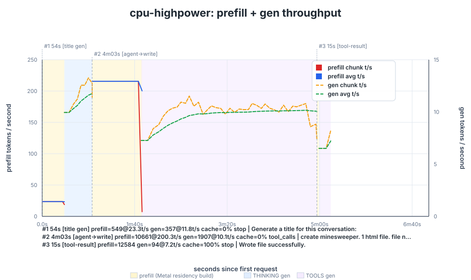</a>
  <a href="plots/dyn-highpower-tok.svg">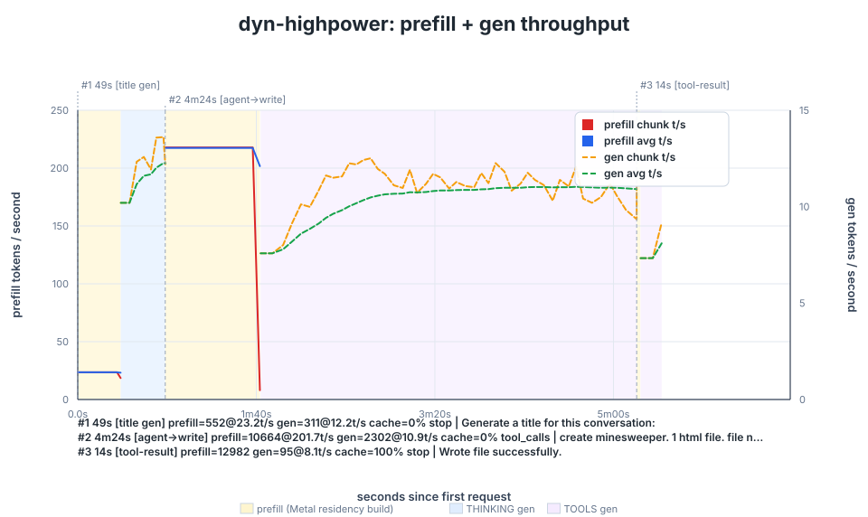</a>
</p>
<p>
  <a href="plots/cpu-normal-tok.svg"></a>
  <a href="plots/dyn-normal-tok.svg">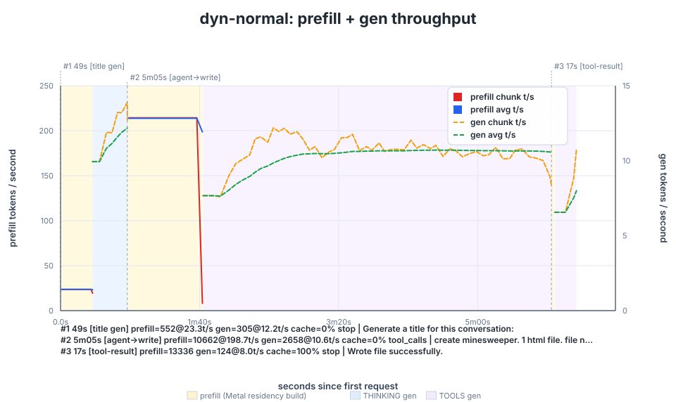</a>
</p>

### 熱 — CPU も GPU も熱マージンで律速

`mactop` の die 温度 / P・E・GPU クロック / パッケージ電力。**CPU 経路を電源モード間で比較**
(通常 vs 高出力)すると throttle が最も分かりやすい。ただし **GPU 経路も同じ**で、dyn を大 budget
(高 hit%)で回すと GPU が本気で動いて発熱し、通常モードでは GPU クロックが落ちて t/s が下がる
(高出力で回復・+10%)。電源を外すと落ちるのは CPU 専用の現象ではない。

**CPU 経路 — 通常(左)vs 高出力(右):**

<p>
  <a href="plots/cpu-normal-mactop-temp.svg">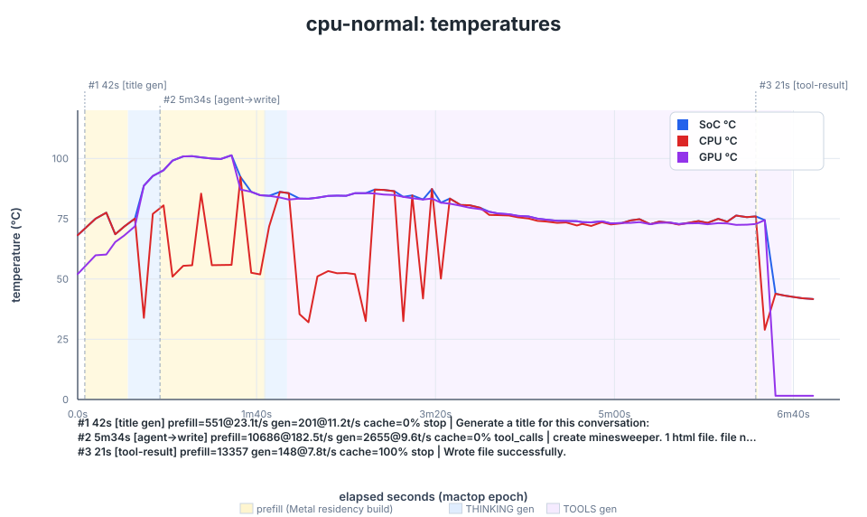</a>
  <a href="plots/cpu-highpower-mactop-temp.svg">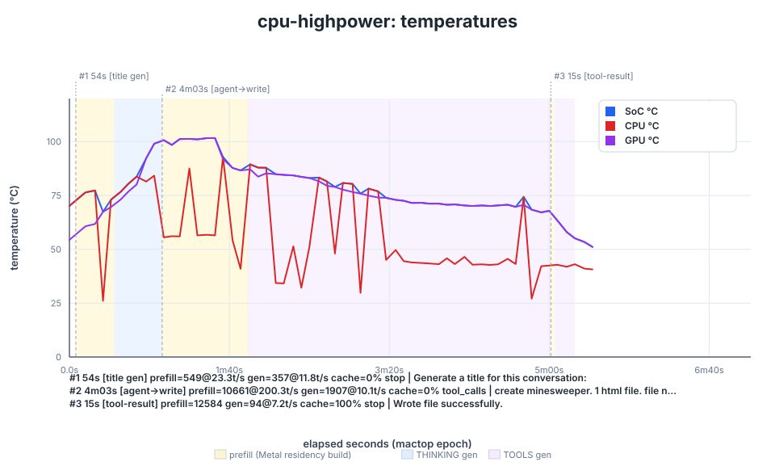</a>
</p>
<p>
  <a href="plots/cpu-normal-mactop-freq.svg">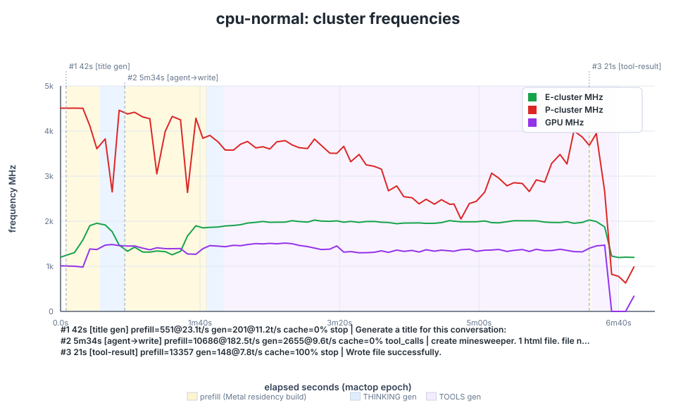</a>
  <a href="plots/cpu-highpower-mactop-freq.svg">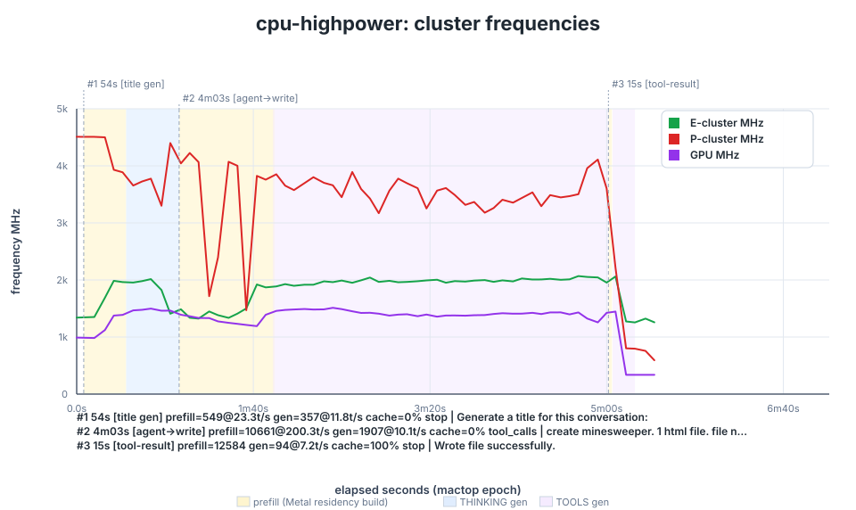</a>
</p>
<p>
  <a href="plots/cpu-normal-mactop-power.svg">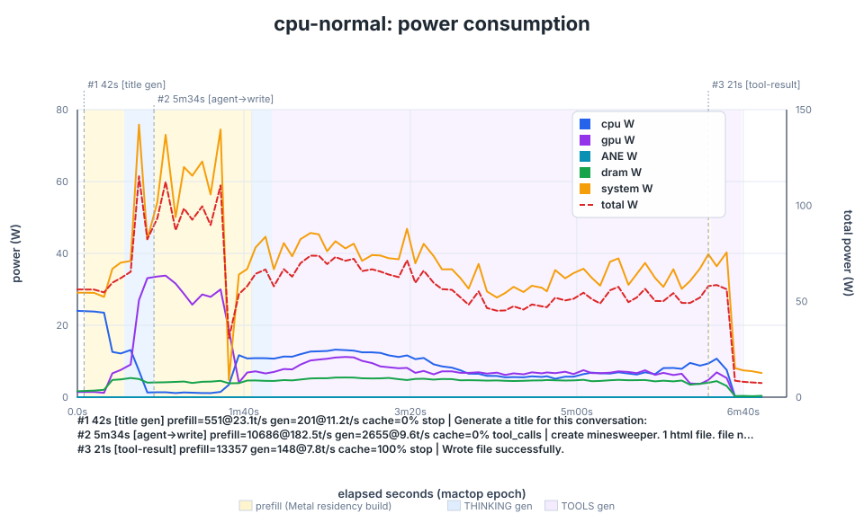</a>
  <a href="plots/cpu-highpower-mactop-power.svg">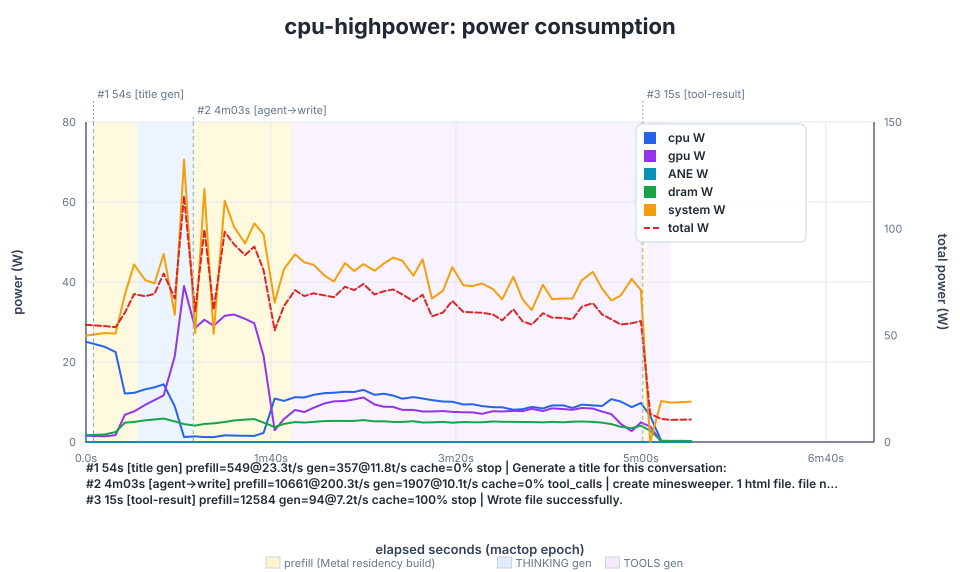</a>
</p>

**`--routed-metal-dynamic`、通常(温度 / クロック / 電力):**

<p>
  <a href="plots/dyn-normal-mactop-temp.svg">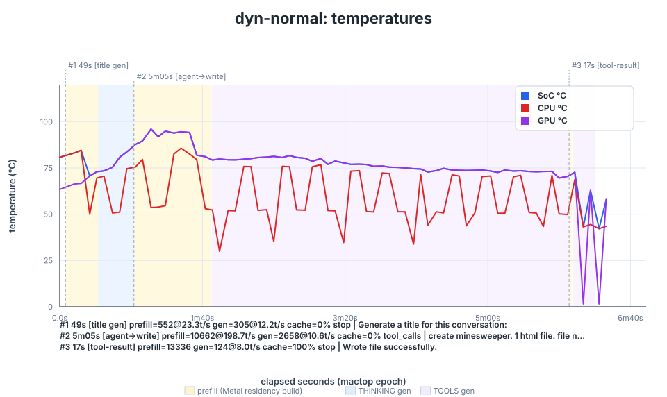</a>
  <a href="plots/dyn-normal-mactop-freq.svg">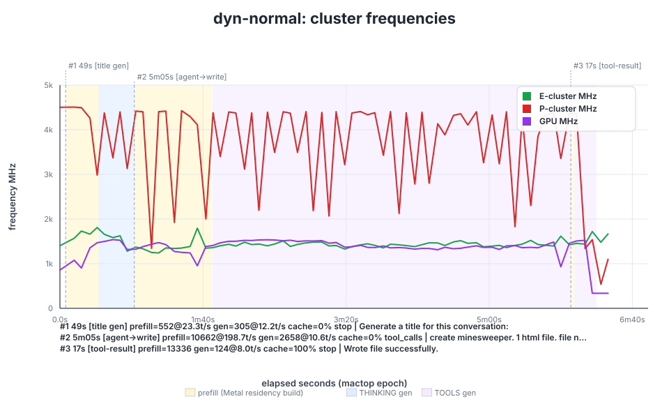</a>
  <a href="plots/dyn-normal-mactop-power.svg">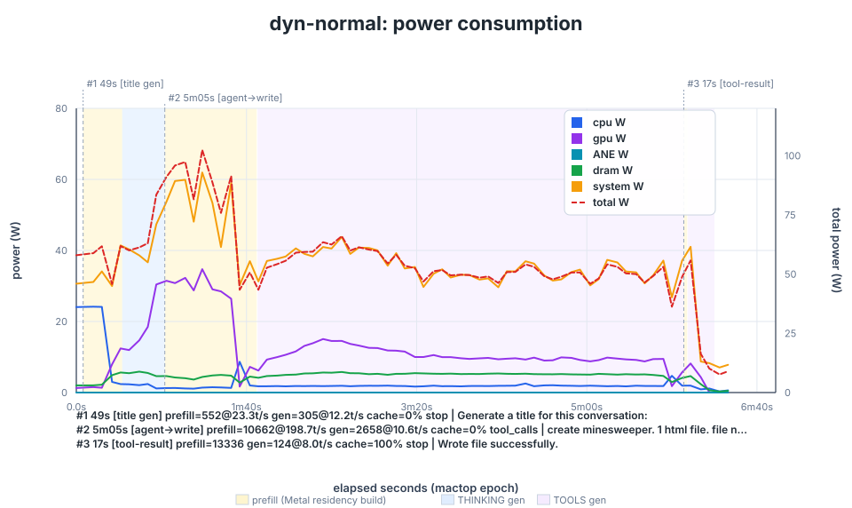</a>
</p>

#### 熱マージンを動かす 3 レバー

gen t/s を決めるのは **熱マージン(冷却能力 − 蓄熱)**。CPU GEMV も GPU GEMV も同じ SoC の
電力/熱枠を共有するので、両経路とも次の 3 つで動く:

1. **外気温**: 冷えた部屋(AC)だと開始 die 温度が下がる。連続 chat・自動モードの実測で
   開始 23 °C → ~10 t/s、開始 56 °C → ~8.6(P-cluster は 65% の時間クランプ)。
2. **macOS 電源モード**: 高出力(システム設定 → バッテリー)は持続電力枠とファンを上げる。
   cpu-moe は opencode で ~10.6 t/s(自動だと ~8)、GPU dynamic も電源で伸びる(大 budget ほど顕著 —
   32 GiB で 10.58 → 10.91、72–80 GiB では +10〜14%)。
3. **ワークロードの形**: opencode は gen が短いターンに分かれ冷却ギャップが入る。chat は gen が
   連続し die が ~96 °C まで焼けてクランプが増える — 同じ電源モードでも chat の方が熱で不利。

→ **速くしたいなら熱マージンを増やす**(高出力 / 部屋を冷やす)。CPU でも GPU でも、開始時に
温まっているほど早く throttle する。run を比較するときは開始 die 温度を揃えること(揃えないと
差の大半が熱履歴ノイズ)。

各キャプチャの全 plot: `plots/<capture>-{tok,vmstat-mem,vmstat-events,mactop-cpu-gpu,mactop-freq,mactop-power,mactop-dram-bw,mactop-net-disk,mactop-temp}.svg`。

## CPU 経路 vs GPU 経路: RAM の使い方

2 つの経路は RAM について正反対のトレードオフを取る — **可搬性 vs 可変な速度つまみ**:

- **`--cpu-moe`(CPU): wired は小さく、page cache に乗る。** 固定するのは ~13 GiB の非 routed
  集合だけなので、`iogpu.wired_limit_mb` の引き上げが不要で wired budget 起因の swap も起きず、
  RAM の少ないマシンでも動く可能性が高い。代わりに gen 速度は **file-backed cache の大きさ**に
  依存する: mmap モデルをキャッシュできる RAM が多いほど SSD ミスが減る — つまり空き RAM が
  多いほど速く、乏しいと遅い。(そしてその速度は熱に弱い — 上の熱の節を参照。)
- **`--routed-metal-dynamic`(GPU): wired budget が*そのまま*速度つまみ。** t/s は budget に
  応じて上がり(hit% 経由、下の sweep で定量化)、`F_RDADVISE` で IO 律速が解けた今は高出力でも
  伸びる(≈+10%)。ただし対価は pin する RAM: budget を上げるほど速いが、RAM の余裕と
  `iogpu.wired_limit_mb` の引き上げが要で、超過すると swap する(下のスイープの swap 注記を参照)。

要するに: **可搬性 / 小さい wired なら CPU、pin できる RAM があり予測可能で可変な t/s が欲しいなら GPU。**

`vmstat-mem` チャートがこの分割をそのまま示す: `--cpu-moe` は wired を小さく保ち(~13 GiB)、
残りの RAM を reclaim 可能な page cache に回す。一方 `--routed-metal-dynamic` は budget を
wired に pin し(例: 32 GiB budget なら ~45 GiB = expert 32 GiB + 非 routed ~13 GiB)、page cache はその分縮む。

<p>
  <a href="plots/cpu-normal-vmstat-mem.svg">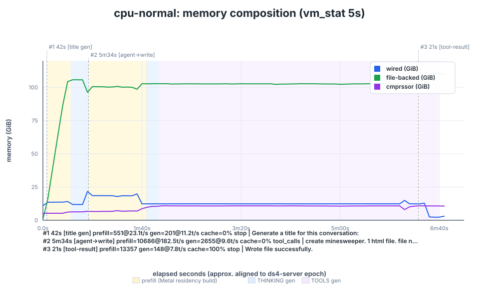</a>
  <a href="plots/dyn-normal-vmstat-mem.svg">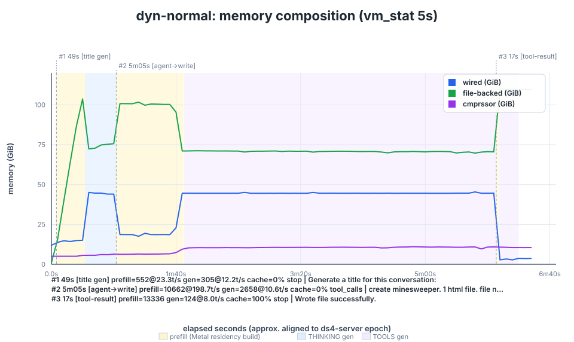</a>
</p>

## wired budget スイープ(通常 / 高出力)

opencode 長 TOOLS ターンの avg(warmup 込み)を budget ごとに、通常 / 高出力 の両電源で。
CPU 行は同ワークロードの cpu-moe 参考値。

| budget   | 通常  | 高出力 | hit% | wired peak | SSD読み 通常/高出力 (GiB) |
|----------|-------|--------|------|------------|---------------------------|
| CPU      | 9.62  | 10.06  | –    | ~13 GiB    | 461 / 409                 |
| dyn 8 G  | 8.14  | 7.81   | ~41  | 8.0 GiB    | 489 / 579                 |
| dyn 16 G | 9.33  | 9.22   | ~59  | 16.0 GiB   | 496 / 524                 |
| dyn 24 G | 10.18 | 10.02  | ~69  | 24.0 GiB   | 425 / 502                 |
| dyn 32 G | 10.58 | 10.91  | ~76  | 32.0 GiB   | 482 / 447                 |
| dyn 40 G | 10.55 | 11.27  | ~80  | 40.0 GiB   | 480 / 445                 |
| dyn 48 G | 10.88 | 11.78  | ~85  | 48.0 GiB   | 416 / 450                 |
| dyn 56 G | 11.08 | 12.05  | ~88  | 56.0 GiB   | 459 / 438                 |
| dyn 64 G | 11.27 | 12.42  | ~91  | 64.0 GiB   | 426 / 440                 |
| dyn 72 G | 11.36 | 12.93  | ~93  | 72.0 GiB   | 422 / 421                 |
| dyn 80 G | 11.46 | 12.60  | ~94  | 80.0 GiB   | 422 / 453                 |

- **budget が LRU hit% を決め、それが t/s を決める** — budget とともに上昇。利得は SSD でなく
  **再 wire(`requestResidency`)の削減**から。
- **電源の効きは budget 依存。** 小 budget(≤24 GiB)は miss が多く IO 寄りなので通常≈高出力
  (むしろ通常がわずかに上のことも)。大 budget ほど hit% が上がり GPU が本気で回るので、
  高出力の利得が出る(72–80 GiB で +10〜14%)。
- **budget を上げ過ぎると swap。** wired(常駐)は reclaim 不可。budget を上げるほど RAM が pin
  され、残り(OS + 文脈長で伸びる KV)を圧迫する。`wired + OS + KV` が物理 RAM を超えると
  `swap-out` が出る(本機では ~96 GiB 超で発生しうる)ので、**最長 ctx で `swap-out = 0` を確認**
  (短いプロンプトでなく)。80 GiB は `iogpu.wired_limit_mb` 既定で wire 可、それ以上は引き上げが要
  (例 `sudo sysctl iogpu.wired_limit_mb=102400`)。`free ≈ 0` は正常 — 空き RAM は reclaim 可能な
  page cache で埋まるだけで、見るべきは `swap-out`。(vm_stat の読み方: `vm_stat <interval>` は
  数十サンプル毎に列ヘッダを再印字し、その**直後の 1 行が boot 起算の累積スナップショット**。
  `Pageins`/`Swapouts` を合算するときはこのヘッダ直後行を**位置で**除外する — 累積行は uptime が
  短いと `K`/`M` が付かず素の整数になり、接尾辞での判定は破綻する。)
- **SSD 読みは budget に関係なく ~410–580 GiB のまま(上表 SSD 列、vm_stat の pageins 累計)。**
  routed expert(145.12 GiB)が RAM をはるかに超えるため絶えず SSD からストリーミングされる。
  総量はワークロードで決まり gen の budget では動かない(列内の上下は opencode 非決定性の run
  ノイズで、budget とのトレンドはない)。gen は wired(RAM 上)の expert を読むので、この SSD
  トラフィックは gen のクリティカルパス外 — gen t/s を律速しない。

## Q2(RAM に収まるモデル)

IQ2_XXS/Q2_K ビルド(routed expert 計 ≈ 72.6 GiB、全体 ≈ 80 GiB)で同じ opencode ワークロードを
回したときの gen t/s(長 TOOLS ターンの avg、warmup 込み。2026-06-03)。**1 routed expert は
≈6.8 MiB で、Q4 の ≈13.5 MiB の約半分**
(同じ budget なら ~2× の数を常駐できる)。`--routed-metal-dynamic` は **full Metal より劣化し、
cpu-moe より速い**中間に位置する:

| Q2 gen t/s                   | t/s   | full Metal 比 |
|------------------------------|-------|---------------|
| full Metal(全 expert wired)  | 22.13 | 100%          |
| dyn 24 GiB wired(hit 85.6%)  | 17.19 | 78%           |
| dyn 40 GiB wired(hit 94.3%)  | 17.56 | 79%           |
| dyn 80 GiB wired(hit 98.3%)¹ | 14.89 | 67%           |
| `--cpu-moe`(CPU gen)         | 7.96  | 36%           |

いずれも swap-free。

- **dyn は full Metal と cpu-moe の中間。** expert GEMV を GPU で回すので cpu-moe(7.96)より速いが、
  expert を LRU で出し入れする分、全 expert 常駐の full Metal(22.13)には届かない。
- **budget 感度は Q4 より鈍い。** 24 GiB(85.6%)と 40 GiB(94.3%)はほぼ同速(差は run ノイズ域)。
  Q2 は expert が小さく LRU miss 時の再 wire が安いので、hit% を上げても削れる時間が少なく、budget で
  t/s が伸びにくい(Q4 sweep は hit% で素直に伸びた)。
- **Q2/Q4 の速度比は expert サイズ比(~2×)に GPU 経路でのみ部分追従。** 同 budget の dyn で Q2 は Q4 の
  ~1.6–1.7×(24–40 GiB)— expert GEMV はバイト数に比例して半減するが、attention・非 routed・dispatch 等の
  固定コストが Q4/Q2 共通で薄めるため 2× には届かない。cpu-moe は逆に Q2 が Q4 と同等〜やや遅い(~0.8×)で、
  CPU gen が weight 帯域でなく演算/熱律速であることを裏づける。
- **キャッシュが温まり切るまでは SSD 読み込みが出る。** LRU residency はコールドで始まるので序盤は
  miss(= SSD page-in)が多く、ターンが進むと working set が wired に乗って hit% が上がる
  (40 GiB で 72 → 94%)。warmup を含む avg はこの立ち上がりを織り込むぶん定常レートより低めに出る。
  ただし Q2 は全体 80 GiB が RAM に収まるので、SSD 読みは全構成で **~80 GiB(モデルをほぼ 1 回読むだけ・
  budget 非依存。vm_stat pageins 実測)** に留まり、温まれば gen の SSD は止む — routed 145 GiB を常時
  ~450 GiB ストリーミングする Q4 とは対照的。

¹ 80 GiB(hit 98.3%・evict 0)は全 expert 常駐に近いが、~68 GiB を wire して GPU を最も酷使する
ため、長ターンの後半で熱により漸減する(序盤は ~17 と 40 GiB 同等で、avg が 14.89 に沈む)。収まる
モデルでも dyn は **wired メモリを抑える上限制御**として効く(full Metal の大半の速度を小さい wired で)。

## 改善余地

cpu-moe baseline([`01-cpumoe-baseline/`](../01-cpumoe-baseline/README.md))で挙げた改善候補に
対する現状。うち 2 つは既に解消済み。**gen の GPU 化 / hot expert の固定**は本機能の
*実際に選ばれた* expert の動的 LRU で実現 — これは baseline の **imatrix** 案も内包する:
`observed_routes` の上位 N を静的 pin しても hot な集合はプロンプト依存で当たらないが、
LRU は router が実際に選んだものを毎ターン wire する。そして cold-start の **warmup** 案は
不要になった — per-layer phases(N=43)+ `F_RDADVISE` prefetch が residency 構築を ~53 s から
計算と重なる小さな per-layer swap に縮めたので、最初の prompt が大きな初回 build を肩代わりしない。

**残る伸びしろ**

- **小〜中規模 prefill の高速化(SME2 か GPU 化)。** 大きい prefill は Metal フェーズで走るが、
  `DS4_PREFILL_METAL_PHASES_MIN_TOKENS` 未満の prefill は CPU NEON i8mm 2×2 にフォールバックする。
  ここを詰める道は 2 つ — (a) **SME2 SMOPA 経路**に載せる(spike で **NEON i8mm 比 3.37×**/P-core、
  ビット一致)、(b) Metal フェーズの対象を小さい prefill まで広げて **GPU 化**する。
- **細粒度の最適化(実装が大雑把)。** 現状の `--routed-metal-dynamic` は Claude Code による粗い
  実装で、機構が成立することの確認が主眼。LRU/wire の定数、prefetch のまとめ方、residency 更新の
  粒度といったホットパスの細部は詰め切れておらず、細かい最適化でまだ伸ばせる。
- **発熱を抑える効率化(perf/W 改善)。** gen t/s は熱マージンで律速される(上の[熱の節](#熱--cpu-も-gpu-も熱マージンで律速))。
  Q2 80 GiB のように GPU を酷使すると長ターン後半で漸減するのもこれ。無駄な wire/再 residency・
  コピー・dispatch を削って **同じ仕事を低い電力で**回せれば、発熱が下がってクランプが遅れ、持続
  t/s が伸びる。上の細粒度最適化とも重なる(perf/W が上がればそのまま熱マージンになる)。

**試したが現状効果なし**

- **MTP(speculative draft + verify)。** token ごとの expert 読みをバッチ化する案。本構成では
  gen を速くしなかった(MTP run は非 MTP ベースラインと同等〜やや下)。

## まとめ

- **`F_RDADVISE` で全経路が速い。** prefill(~2×)、CPU gen(5.4 → ~10)、GPU dynamic 経路(IO 律速
  解消)。dyn は budget(hit%)と電源でスケールし、中庸な 32 GiB で通常 10.58 / 高出力 10.91 t/s —
  **01 baseline(5.37)の ~2×**(80 GiB なら 11.46 / 12.60)。
- **熱は CPU・GPU 両方を律速。** 高出力+冷房で両経路とも伸び、外すと落ちる。
- **wired メモリの調整つまみ**(Q2 で顕著): wired を抑えつつ GPU の利得を大半保てる。
- 既定 off / 実験的。budget を上げ過ぎると swap — 最長 ctx で `swap-out = 0` を確認(80 GiB は
  `iogpu.wired_limit_mb` 既定で wire 可)。

## 再現

共有ドライバスクリプト `../scripts/q4-experiment.sh [mode]`(env 上書き `BUDGET_MIB` /
`TAG` などはスクリプト冒頭参照)。**この session ディレクトリから**実行する(ログは cwd に
落ちる)。モード: `sweep`(budget→t/s 表)、`opencode`(実エージェント)、`oc-cpu`(CPU
ベースライン)、`perfab`(warm 定常 A/B)、`bench`、`chat`。

```sh
bash ../scripts/q4-experiment.sh sweep                      # cpu baseline + dyn budget スイープ
BUDGET_MIB=81920 bash ../scripts/q4-experiment.sh opencode  # dyn 80 GiB、実ワークロード
bash ../scripts/q4-experiment.sh oc-cpu                     # 純 CPU ベースライン
# Q2(RAM に収まる): TAG=q2 で IQ2_XXS モデル + q2-* ログ prefix を選択。
# budget < 72.6 GiB にしないと LRU が evict せず full residency に縮退:
TAG=q2 BUDGET_MIB=40960 bash ../scripts/q4-experiment.sh opencode
```

plot: `python3 ../scripts/make_plots.py 02-routed-metal-dynamic`(4 つの
`<capture>-ds4-server.log` prefix を自動検出し `plots/` を生成)。
